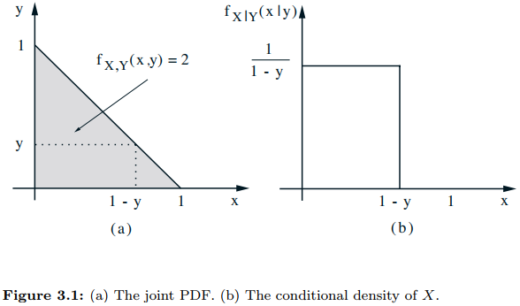

## 3.5 conditioning problems

### 3.18

设 $X$ 是一个随机变量，其概率密度函数为：
$$
f_X(x)=\cases{
\frac{x}{4}, & 若 $1< x \le 3$, \\
0, & 其他
}
$$
令 $A=\{X\ge 2\}$

(a) 计算 $E[X], P(A), f_{X|A}(x), E[X|A]​$ 

(b) 令 $Y=X^2$ ，计算 $E[Y], var(Y)$ 。

解答：

(a)
$$
E[X]=\int_{1}^{3}xf_X(x)dx=\int_{1}^{3}x\frac{x}{4}dx = \frac{x^3}{12}|_1^3=\frac{13}{6} \\
P(A)=\int_{2}^{3}f_X(x)dx=\int_{2}^{3}\frac{x}{4}dx=\frac{x^2}{8}|_2^3=\frac{5}{8} \\
f_{X|A}(x)=\cases{
    \frac{f_X(x)}{P(A)}=\frac{2x}{5}, & $x\in A$, \\
    0, & 其他
} \\
E[X|A]=\int_{2}^{3}xf_{X|A}(x)dx=\int_{2}^{3}x\frac{2x}{5}dx=\frac{2x^3}{15}|_2^3=\frac{38}{15}
$$
(b)
$$
E[Y]=\cases{
\int Y f_X(x)dx=\int x^2f_X(x)dx=\int_1^3\frac{x^3}{4}dx=\frac{x^4}{16}|_1^3=5, & $1< x \le 3$, \\
0,
}\\
E[Y^2]=\cases{
\int Y^2 f_X(x)dx=\int x^4f_X(x)dx=\int_1^3\frac{x^5}{4}dx=\frac{x^6}{24}|_1^3=\frac{91}{3} & $1< x \le 3$, \\
0,
}\\
var(Y)=E[Y^2]-(E[Y])^2=\frac{16}{3}
$$

### 3.20

一个粗心的教授错误地将两个学生的答疑时间安排在了同一个时间段。已知两位同学的答疑时间长度是两个相互独立的并且同分布的随机变量，分布是指数分布，期望值为 $30$ 分钟，第一个学生按时到达，5分钟以后，第二个学生也到达。从第一个学生到达起直到第二个学生离开所需要时间的期望值是？

解答：

用 $T_{total}$ 表示教授答疑总共用时的随机变量，用 $T_{s_1}, T_{s_2} $ 表示教授分别对学生 $1$ 和学生 $2$ 答疑时间，那么
$$
E[T_{total}]=P(T_{s_1}< 5) \cdot E[5+E[T_{s_2}]] + P(T_{s_1} \ge 5)(E[T_{s_1}|T_{s_1}\ge5]+E[T_{s_2}])
$$
据题目得：$E[T_{s_1}]=E[T_{s_2}]=30$ ，利用[指数型随机变量的无记忆性]()得到：$E[T_{s_1}|T_{s_1}\ge5] = 5+E[T_{s_1}] = 35$ 。
$$
P(T_{s_1} \ge 5) = e^{-\frac{1}{30}\cdot5} \\
P(T_{s_1} < 5)=1-P(T_{s_1}\ge 5)=1-e^{-\frac{1}{30}\cdot5}\\
$$
因此：
$$
E[T_{total}]=(1-e^{-\frac{1}{30}\cdot5})\cdot (5+30)+(e^{-\frac{1}{30}\cdot5})\cdot (35+30)=35+30\cdot e^{-\frac{5}{30}}=60.394
$$

### 3.21

从一个长度为 $l$ 的杆开始，在杆上随机找一个点，以这个点为切断点，将杆分为两半。保留杆的左边部分，设这部分的长度为 $Y$ 。对于长度为 $Y$ 的这根杆子，重复这一切断的过程，设第二次切断后保留下来的部分长度为 $X$ 。

(a) 求出 $X,Y$ 的联合概率密度函数。

(b) 求 $X$ 的边缘概率密度函数。

(c) 利用  的边缘概率密度函数计算 $E[X]$ 。

(d) 利用关系式 $X=Y\cdot(\frac{X}{Y})$ 计算 $E[X]$ 。

解答：

(a) $f_Y(y)=\frac{1}{l},  0\le y\le l$ . 因此在 $y$ 值在给定情况下。随便变量 $X$ 均匀分布在 $[0,y]$ ，所以 $f_{X|Y}(x|y)=\frac{1}{y}, 0\le x\le y $ 。总结如下：
$$
f_{X,Y}(x,y)=f_Y(y)f_{X|Y}(x|y)=\cases{
    \frac{1}{l} \cdot \frac{1}{y}, & $0 \le x \le y \le l$, \\
    0, & otherwise
}
$$
(b) 
$$
f_X(x)=\int f_{X,Y}(x,y)dy=\int_{x}^{l}\frac{1}{ly}dy=\frac{1}{l}ln(\frac{l}{x}), \quad 0\le x \le l
$$
(c)
$$
E[X]=\int_{0}^{l}xf_X(x)dx=\int_{0}^{l}\frac{x}{l}ln(\frac{l}{x})dx=\frac{l}{4}
$$
(d) 第一次折断以后，杆的 $\frac{Y}{l}$ 部分被留下来，经过第二次折断之后，杆的 $\frac{X}{Y}$ 被留了下来，而这两次折断是独立的

事件。而且，随机变量 $Y$ 和 $\frac{X}{Y}$ 是分别均匀分布在 $[0,l]$ 和 $[0,1]$ 之间的，因此 $E[Y]=\frac{l}{2}$ ，$E[\frac{X}{Y}]=\frac{1}{2}$ 。因此：
$$
E[X]=E[Y]E[\frac{X}{Y}]=\frac{l}{2} \cdot \frac{1}{2}=\frac{l}{4}
$$

### 3.22

有一根长度为 $l$ 的杆，利用3种不同的方法将杆子截成 $3$ 段。

1.  在杆子上随机且独立地选取 $2$ 个点（每个点被选取都是等可能的，以下描述类同），在这两个点处将杆子截断。
2.  首先，在杆子上随机地选取一个点，在这个点处将杆子截断，然后将包含原右端点的这一段按同样的方法地截成 $2$ 段。
3.  首先，在杆子上随机的选取一个点，在这个点处将杆子截成 $2$ 段，然后将较长的那一段按同样的方法再截成 $2$ 段。

对这 $3$ 种方法的每种方法，分别求出截成小段后杆子能组成一个三角形的概率。

解答：

将原杆子长度标准化一下，视为总长为 $1$ 的杆子，左端点视为 $0$ 点（原点），右端点视为 $1$ 的点。用 $X$ 表示第一次截取点的位置，$Y$ 表示第二次截取点位置。将$X,Y$ 放置到坐标系下观察。对于方法 2，那么 $X < Y$ 。对于方法1和3，我们假设 $X<Y$ ，随后利用对称性解释 $Y<X$ 的情况。

**假设 $X<Y$ 的情况下**，那么3段长度分别为：$X, Y-X, 1-Y$ 。它们能组成三角形的前提是：任意两端的和大于第三段：
$$
X<(Y-X)+(1-Y),\quad (Y-X)<X+(1-Y),\quad (1-Y)<X+(Y-X)
$$
化简即：
$$
X<0.5,\quad Y-X<0.5,\quad Y>0.5
$$
对于方法1：$X,Y$ 满足上述3个条件下，坐标 $(X,Y)$ 必须处在顶点 $(0,0.5),(0.5,0.5),(0.5,1)$ 围成的三角形内（在直角坐标系下画出区域得到），这个三角形面积为样本空间的 $\frac{1}{8}$ ，根据对称性，在 $Y<X$ 的情况下，方法1得到符合组成三角形这个事件的概率也是 $\frac{1}{8}$ 。因此按照方法1，由于在 $X<Y$ 和 $X>Y$ 这两个条件下产生的事件是独立地，因此，按照方法1截断杆子成能够拼成三角形的三段的概率为：$\frac{1}{4}$ 。

对于方法2： $X,Y$ 满足均匀分布地随机变量，且 $0<X<Y<1$ ，$f_{x,y}(x,y)=f_{X}(x)f_{Y|X}(y|x)=1\cdot \frac{1}{1-x}$ 。那么在上述3个条件下，坐标 $(X,Y)$ 必须处在顶点 $(0,0.5),(0.5,0.5),(0.5,1)$ 围成的三角形内（在直角坐标系下画出区域得到），那么概率可由积分得到：
$$
\begin{eqnarray}
\int_{0}^{\frac{1}{2}}\int_{\frac{1}{2}}^{\frac{x+1}{2}}f_{X,Y}(x,y)dydx&=&\int_{0}^{\frac{1}{2}}\int_{\frac{1}{2}}^{\frac{x+1}{2}}\frac{1}{1-x}dydx =\int_{0}^{\frac{1}{2}}\frac{x}{1-x}dx \\
&=& \int_{0}^{\frac{1}{2}}\frac{[-(1-x)+1]}{1-x}dx = \int_{0}^{\frac{1}{2}}[\frac{1}{1-x}-1]dx \\
&=& [-ln(1-x)-x]|_{0}^{\frac{1}{2}} \\
&=& -\frac{1}{2}+ln2
\end{eqnarray}
$$
对于方法3：先考虑 $X<0.5$ 的情况，那么第一次折断产生的两段中比较长的那一段是右边那一段，这正如方法2的情形。但是还有一种情况是 $X>0.5$ 的情况，那么 $0<Y<X<1$ 。根据对称性，得到在方法3下，3段能拼成三角形的概率为方法2的两倍，即 $-1+2ln2$ 。

### 3.23

设在直角坐标系中3个点 $(0,0),(0,1),(1,0)$ 组成的一个三角形。假定 $(X<Y)$ 是一个随机选择的点的坐标，这个随机点是在三角形上均匀分布的。

1.  找出 $X$ 和 $Y$ 的联合概率密度函数。
2.  找出 $Y$ 的边缘概率密度函数。
3.  找出 $X$ 的在给定 $Y$ 值之下的条件概率密度函数。
4.  求出 $E[X|Y=y]$ ，利用全期望定理求出 $E[X]$ 的依赖于 $E[Y]$ 的表达式。
5.  利用对称性求出 $E[X]$ 。

解答：

1.  由于随机变量是均匀分布的，样本空间的面积是 $\frac{1}{2}$ ，因此 $f_{X,Y}=2$ 。

2.  $f_Y(y)=\int_{-\infty}^{+\infty}f_{X,Y}(x,y)dx=\int_{0}^{1-y}2dx=2(1-y), \quad 0\le y \le 1$

3.  $f_{X|Y}(x|y)=\frac{f_{X,Y}(x,y)}{f_Y(y)}=\frac{1}{1-y}, \quad 0 \le x \le 1-y$ 条件概率密度函数正如上图(b)所示

    .png)

4.  ​
$$
E[X|Y]=\int xf_{X|Y}(x,y)dx=\int_{0}^{1-y}x\frac {1}{1-y}dx=\frac{1}{2}x^2\cdot\frac{1}{1-y}|_0^{1-y}=\frac{1-y}{2}, 0\le y < 1\\
    E[X]=\int E[X|Y]f_Y(y)dy=\int_{0}^{1}\frac{1-y}{2}f_Y(y)dy=\int_0^1 \frac{1}{2}f_Y(y)dy-\frac{1}{2}yf_Y(y)dy=\frac{1}{2}-\frac{1}{2}E[Y]
$$

5.  根据对称性性，$E[X]=E[Y]$ ，又因为： $E[X]=\frac{1}{2}-\frac{1}{2}E[Y]=\frac{1}{2}-\frac{1}{2}E[X]\rightarrow E[X]=\frac{1}{3}$

### 3.24

设在直角坐标系中三个点 $(0,0),(1,0), 和 (0,2)$ 组成一个三角形。假定 $(X,Y)$ 是一个随机点的坐标，这个随机点是三角形上均匀分布的（与题 $23$ 不同，此题中的 $X$ 和 $Y$ 是不对称的），按题 $23$ 中求出 $E[X]$ 和 $E[Y]$ 。

解答：

显然这个三角形是由 $X, Y$ 轴和直线 $y=-2x+2$ 围成的。在给定 $y$ 的情况下，$x\in [0,\frac{(2-y)}{2}]$ ，$X,Y$ 联合条件概率密度为 $f_{X,Y}=\frac{1}{1\times 2 \div 2}=1$ 
$$
f_Y(y)=\int_{-\infty}^{+\infty}f_{X,Y}dx= \int_{0}^{\frac{2-y}{2}}1dx=\frac{2-y}{2}\rightarrow f_{X|Y}(x,y)=\frac{f_{X,Y}(x,y)}{f_Y(y)}=\frac{2}{2-y}\rightarrow \\
E[X|Y=y]=\int_{-\infty}^{+\infty} xf_{X|Y}(x,y)dx=\int_{0}^{\frac{2-y}{2}}\frac{2x}{2-y}dx=\frac{x^2}{2-y}|_{0}^{\frac{2-y}{2}}=\frac{2-y}{4}, \quad y\in [0,2]
$$
再使用期望的全概率公式，得到：
$$
E[X]=\int_{0}^{2}\frac{2-y}{4}f_Y(y)dy=\int_{0}^{2}\frac{2}{4}f_Y(y)-\frac{1}{4}yf_Y(y)dy=\int_{0}^{2}\frac{2-y}{4}dy-\frac{1}{4}E[Y]=\frac{1}{2}-\frac{1}{4}E[Y]
$$
类似地，在给定 $x$ 的条件下，$y\in [0,2-2x]$ ，那么：
$$
E[Y|X=x]=1-x, \quad 0 \le x \le 1
$$
因此：
$$
E[Y]=\int_{0}^{1}(1-x)f_X(x)dx=1-E[X]
$$
联合 $E[X], E[Y]$ 的公式，得到：
$$
E[X]=\frac{1}{3},\quad E[Y]=\frac{2}{3}
$$

### 3.25

设平面上一个随机点的两个坐标为 $X$ 和 $Y$ 。它们是独立同分布的正态随机变量，公共期望为 $0$ ，方差为 $\sigma^2$ 。已知这个点离原点的距离至少为 $c$ 。求 $X$ 和 $Y$ 的条件联合概率密度。 

解答：

用 $C$ 表示 $X^2+Y^2 \ge  c^2$ 事件，概率 $P(C)$ 通过极坐标系可以计算如下：
$$
\begin{eqnarray}
P(C) &=& \frac{1}{2\pi \sigma^2}\int_{0}^{2\pi}\int_{c}^{\infty}re^{\frac{-r^2}{2\sigma^2}}drd\theta \\
&=& \frac{1}{\sigma^2}\int_{c}^{\infty}re^{\frac{-r^2}{2\sigma^2}}dr\\
&=&e^{\frac{-c^2}{2\sigma^2}}
\end{eqnarray}
$$
因此，
$$
\forall (X,Y)\in C, f_{X,Y|C}(x,y)=\frac{f_{X,Y}(x,y)}{P(C)}=\frac{1}{2\pi\sigma^2}e^{-\frac{1}{2\sigma^2}(x^2+y^2-c^2)}
$$

## 3.6 The Continuous Bayes' Rule problems

### 3.34 

一台有问题的硬币浇铸机所生产的硬币是有缺陷的，它生产的硬币在抛掷试验中正面出现的概率 $P$ 是一个随机变量。 $P$ 的概率密度函数是：
$$
f_P(p)=\cases{
    pe^p,  & $p\in [0,1]$ ,\\
    0, & 其他
}
$$
现在从这批产品中抽取一枚进行抛掷硬币试验，进行独立重复的抛掷。

1.  求出抛掷硬币的时候，正面出现的概率。

    使用 $A$ 表示抽出的硬币抛掷试验是正面朝上，使用连续版本的全概率公式和分部积分法：
    $$
    P(A)=\int_{0}^{1}P(A|P=p)f_P(p)dp=\int_{0}^{1}p^2e^pdp=e-2
    $$

2.  已知抛掷一枚硬币后出现正面，求 $P$ 的条件概率密度函数。
    $$
    f_{P|A}(p)=\frac{P(A|P=p)f_P(p)}{P(A)}=\cases{
        \frac{P^2 e^p}{e-2}, & $0\le p \le 1$ , \\
        0, & otherwise
    }
    $$

3.  给定第一次抛掷的结果是出现正面。求第二次抛掷硬币的时候出现正面的条件概率。

    使用 $B$ 表示第二次抛掷硬币的时候出现正面，那么
    $$
    \begin{eqnarray}
    P(B|A) &=& \int_{0}^{1}P(B|P=p,A)f_{P|A}(p)dp \\
    &=& \int_{0}^{1}P(B|P=p)f_{P|A}(p)dp\\
    &=& \frac{1}{e-2}\int_{0}^{1}p^3e^pdp \\
    &=& \frac{1}{e-2} \cdot (6-2e) \\
    &=& 0.786 \\
    \end{eqnarray}
    $$
    ​
